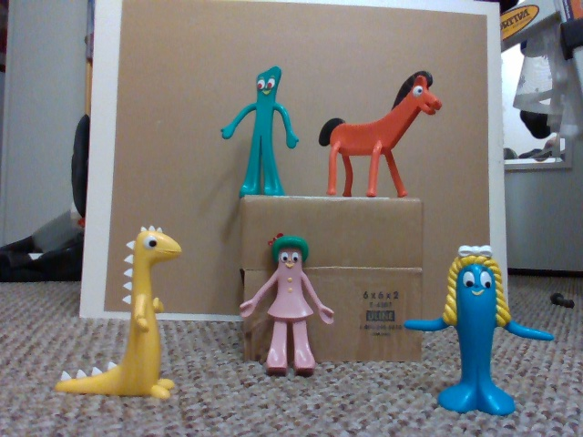

# Gumby and friends YOLO detector
There are two projects
1. `yolo_training` for training the Gumby model
2. `object_detector` that builds three applications that use the Gumby model
    1. *ocv_obj_detector* that uses a webcam and displays class confidence values
    2. *ocv_fr_obj_detector* that does the same with image files read from a directory
    3. *ocv_rs2_obj_detector* that uses an Intel RealSense2 camera that will also display distance to found objects 

